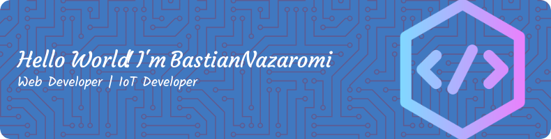

## Hello World! I'm Bastian Nazaromi 👋

<!--
**bastiannazaromi/bastiannazaromi** is a ✨ _special_ ✨ repository because its `README.md` (this file) appears on your GitHub profile.

Here are some ideas to get you started:

- 🔭 I’m currently working on ...
- 🌱 I’m currently learning ...
- 👯 I’m looking to collaborate on ...
- 🤔 I’m looking for help with ...
- 💬 Ask me about ...
- 📫 How to reach me: ...
- 😄 Pronouns: ...
- ⚡ Fun fact: ...
-->

-   🔭 I’m currently working on [**@poltekharber**](https://poltekharber.ac.id)
-   🌱 I’m currently learning **MERN Technology**

##### I code with

  

      

##### Contact with me

   

##### My Github Stats

